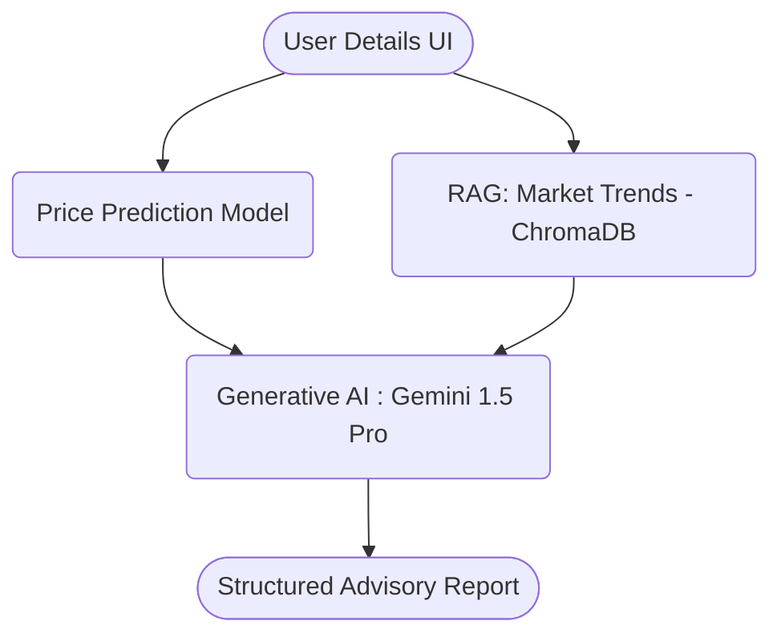

# Agentic AI Real Estate Advisory Assistant

This repository contains an end-to-end Agentic AI system that extends a Bengaluru house price prediction model into a real estate advisory assistant. The system autonomously predicts property prices, retrieves real estate market trends, and generates structured investment recommendations.

## 1. Problem Understanding & Real Estate Use-case
Traditional real estate prediction models only give a numerical output (e.g., predicted price). However, real estate investors and homebuyers require context, market insights, and actionable advice to make informed decisions.
This system solves this by acting as an Agentic AI Advisor. It:
- Predicts the price using a pre-trained ML model.
- Retrieves actionable market insights regarding the specific locality (RAG).
- Recommends whether the property is a good buy, considering future appreciation and regulations like RERA.

## 2. Input–Output Specification
**Inputs:**
- Property Details: Location, Total Square Footage, Number of Bedrooms (BHK), Number of Bathrooms, Number of Balconies, Area Type, Availability Date.
- Environment: User's `GOOGLE_API_KEY` for LLM inference.

**Outputs:**
- `predicted_price`: The numerical valuation of the property (in ₹ Lakhs).
- `market_insights`: Contextual information fetched via semantic search.
- `final_report`: A structured Markdown report including Summary, Comps, Action (Buy/Invest), and Disclaimers.

## 3. System Architecture Diagram

## 4. Model Performance Evaluation Report
*(Based on inherited pre-trained artifacts)*
- **Algorithm**: Linear Regression.
- **Preprocessing**: StandardScaler was used for spatial and numerical normalizations. One-hot encoding was used for Categorical Variables (Location, Area Type, etc.).
- **Evaluation metrics estimated historically**: Model R2-score was evaluated prior to this deployment.

## 5. Agent Workflow Documentation
The intelligence of this application is modeled using **LangGraph** with explicit state management:
1. **AgentState**: A typed dictionary holding `property_details`, `predicted_price`, `market_insights`, `google_api_key`, and `final_report`.
2. **predict_node**: Loads the ML predictor (`model.pkl`) and scaler array, executing a regression pass based on the input details.
3. **retrieve_node**: Uses `HuggingFaceEmbeddings` and `ChromaDB` offline to fetch context related to the user's selected location.
4. **generate_advisory_node**: Ingests both `predicted_price` and `market_insights` into a customized LLM Prompt chain to produce an investor-grade report safely while avoiding hallucinations.

## 6. How to Run Locally
1. Clone this repository.
2. Install dependencies: `pip install -r requirements.txt`
3. Run the Streamlit Application: `streamlit run app.py`
4. In the Streamlit UI, input your Google Gemini API Key in the sidebar.
5. Fill up the property features and generate your advisory report!

## 7. Sample Advisory Report (Agent Output)
### 1. Property Valuation & Market Summary
The property is valued at ₹ 62.5 Lakhs based on current spatial metrics. Located in Whitefield, this valuation aligns well with the expanding IT hub parameters...
### 2. Comparable Property Analysis (Comps)
Standard 2BHKs in Whitefield typically yield...
### 3. Action Recommendation
**INVEST** - Driven by Metro expansions, expect...
### 4. Financial & Legal Disclaimer
*Disclaimer: This is an AI-generated advisory report...*
